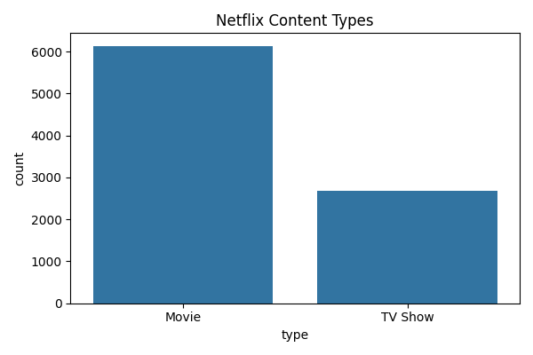
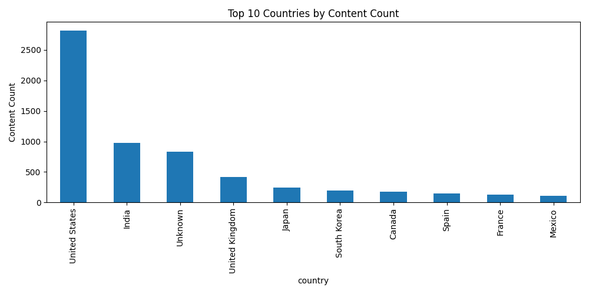
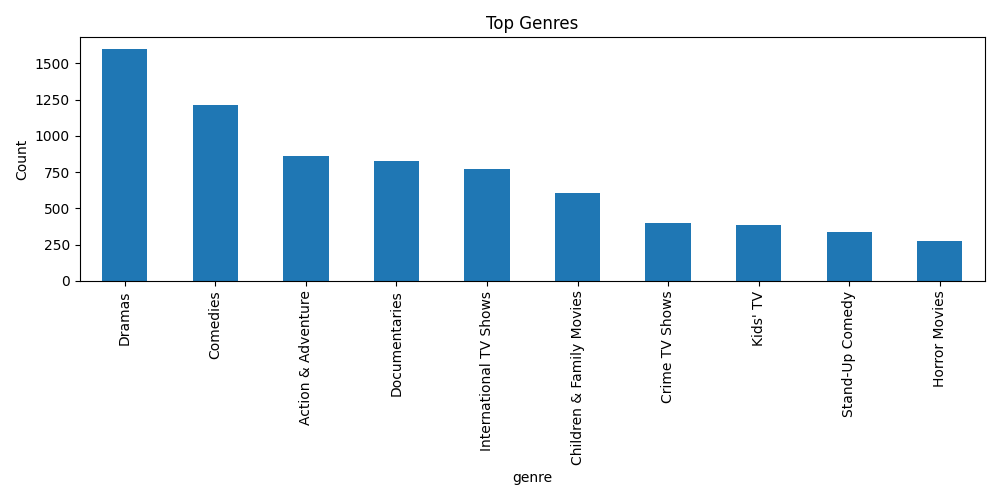
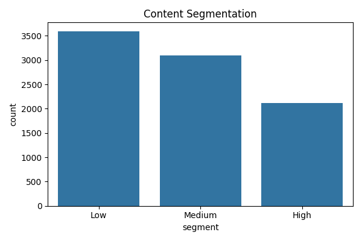

# Netflix Data Analysis

## Project Overview

This project analyzes Netflix content using Python, Pandas, NumPy, Matplotlib, and Seaborn.

The analysis includes:

- Content type distribution (Movies vs TV Shows)
- Top content-producing countries
- Most common genres
- Average content duration
- Rule-based content scoring
- Content segmentation (High, Medium, Low)
- Basic matrix operations using NumPy

## Technologies Used

- Python
- Pandas
- NumPy
- Matplotlib
- Seaborn

## Content Type Distribution

## Top Countries

## Top Genres

## Content Segmentation

## Key Findings

- Movies dominate the Netflix catalog.
- A small number of countries contribute a large portion of content.
- Drama-related genres are highly represented.
- Content was segmented using a custom scoring model.

Mehmet Özcan